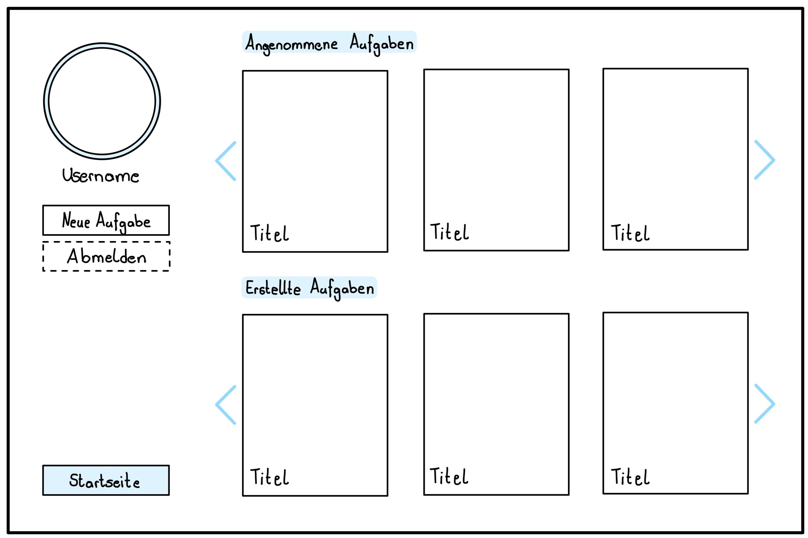
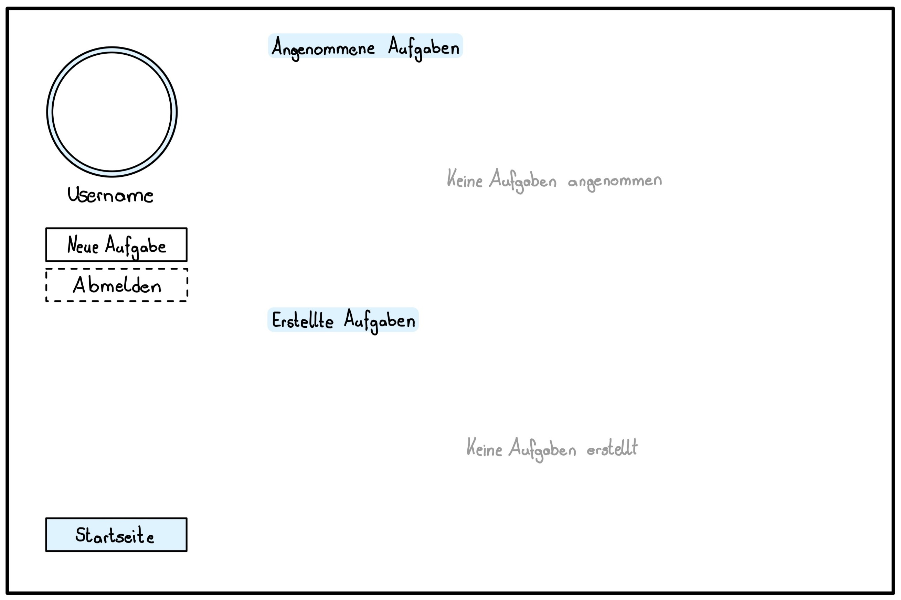

# Wireframes

## Startseite
Eine Übersicht aller Aufgaben, mit einer Suchleiste um nach bestimmten Aufgaben suchen zu können.
Auch kann man nach den vorgegebenen Filter filtern.

Falls der Benutzer noch nicht angemeldet ist, steht neben dem Profilbild nicht der Benutzername,
sondern der Schriftzug **"Anmelden"**:

## Profilseite
Durch eine klick auf den Benutzernamen bzw. auf das Profilbild gelangt man zur Profilübersicht.
Auf dieser sind die **angenommenen Aufgaben** und die eigens **erstellten Aufgaben**
in einer übersichtlichen Slideshow zu sehen.

Falls noch keine Aufgaben erstellt oder angenommen worden sind, ist der Schriftzug
**"Keine  Aufgaben angenommen"** und/oder **"Keine Aufgaben erstellt"** zu sehen:

Durch einen Klick auf den Button **"Startseite"** kommt man zurück zur Startseite.

## Aufgaben-Detailansichtsseite
Auf der Detailansicht der einzelnen Aufgaben sind alle für die Helfer relevanten Informationen zu finden.

Dazu zahlt:
* der Titel der Aufgabe
* Eine Beschreibung der Aufgabe
* Wo die Aufgabe zu erledigen ist. (in Form eines Ortes inklusive PLZ)
* Die zu erwartende Belohnung
* Mit welchem Aufwand zu rechnen ist. (Auf einer Skala von 1 bis 10)

Um sich bei dem Auftrag ersteller zu melden, gibt es einen Button **"Bewerben"**

Um Zurück auf die Startseite zu kommen, gibt es eine klickbaren Pfeil unter dem Beschreibungstext.

## Zusammanhang der einzelnen Seiten
Ein Überblick der einzelnen Seiten und wie diese zusammenhängen.

